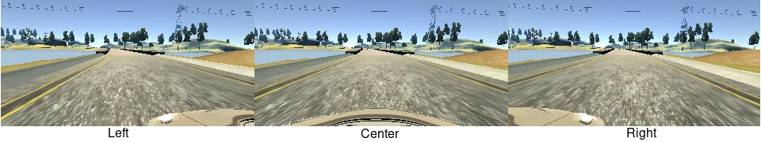
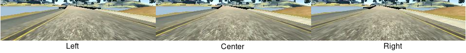

## Behavioral Cloning

This project implements behavioral cloning for driving a car in [Udacity's Simulator](https://github.com/udacity/self-driving-car-sim) using [Keras](https://keras.io/). 

### Demo

[HQ version](https://gfycat.com/HorribleTintedAmphibian) or see `video.mp4` for two laps of driving.

### Repository

#### Files
The repository consists of

- `model.py` to prepare data, define, train and save the model.
- `model.h5` the trained model.
- `drive.py` used to control the simulator from the trained model. Same as in [original repository](https://github.com/udacity/CarND-Behavioral-Cloning-P3) but speed adjusted to 20.
- `video.mp4` demo of the trained model driving in the simulator.
- `README.md` this file which is also my writeup for the project. Written with [StackEdit](https://stackedit.io/). See also a [rendered version](https://github.com/pesser/behavioral_cloning).

#### Useage
To download the training data, train the model and save the best one (according to the validation loss) run

    python model.py

The model will be saved as `./model.h5`. To test it in the simulator, run

    python drive.py path/to/model.h5

and start [the simulator](https://github.com/udacity/self-driving-car-sim) in autonomous mode. Make sure to remove the generated file `data/data.p` if you want to retrain on modified training data (just put additonal data collected by the simulator into `data/` and `model.py` will automatically incooperate it).

### Model overview
The beginning of `model.py` is responsible for obtaining the training data (both the provided sample data and an additional dataset). In `prepare_data()`, all the datasets are merged into a convenient data structure containing steering, throttle, brake and speed data together with the corresponding center, left and right images. The data is fed into the network with the help of the generator `FileFlow`, which loads batches of images on the fly, augments them if it is training data and shuffles the dataset after each epoch. Finally, the model is defined in the `Model` class using [Keras](https://keras.io/). It learns a mapping from images to steering commands using the squared error between prediction and ground truth as regression loss.

#### Architecture
The network first normalizes the image intensities to [-1, 1] and crops them. After that it uses multiple convolutional layers followed by ReLU units. These convolutional layers use an exponentially increasing number of feature maps and a stride of two to keep the computational complexity moderate and to increase the receptive field. Finally, the last convolutional layer produces a single feature map which is then reduced to a single output via global average pooling.

#### Overfitting
To combat overfitting, data use is maximized by utilizing all three camera images, center, left and right, and flipping the images and steering commands. Moderate dropout is used in all non-output layers. Overfitting is monitored with the help of a validation split and early stopping is implemented by saving the model only if the validation loss improved.
#### Training
Training uses the [Adam](https://arxiv.org/abs/1412.6980) optimizer with default parameters to minimize the mean squared error on batches of size 64 for 100 epochs. I consistently find the combination of Adam with ReLU units and [He normalization](https://arxiv.org/abs/1502.01852) to work without problems amongst a large variety of models.

#### Training data
The [provided sample data](https://d17h27t6h515a5.cloudfront.net/topher/2016/December/584f6edd_data/data.zip) is used together with [additional data](https://drive.google.com/open?id=0B_2YVqPvaFeTSmtBUDlGcHhTWWc) that I collected. It consists of frames collected mainly in curves while driving two laps in forward direction and one lap in reverse direction to get more variety and counteract a bias towards zero steering command by focusing on curves. After splitting into training, validation and testing datasets it is summarized as follows:

|  Split   | Samples  |  Height  |  Width   | Channels |
|----------|----------|----------|----------|----------|
|  train   |   6879   |   160    |   320    |    3     |
|  valid   |   1474   |   160    |   320    |    3     |
|   test   |   1475   |   160    |   320    |    3     |

### Design documentation
I had already gained some experience in behavioral cloning for driving simulators in a previous project (see [presentation](https://drive.google.com/file/d/0B_2YVqPvaFeTQjJ1b2I1Q1NLQXc/view?usp=sharing) and [demo](https://gfycat.com/ResponsibleHeavenlyAiredaleterrier)), where I implemented an end-to-end model using [Caffe](http://caffe.berkeleyvision.org/) for driving in [TORCS](http://torcs.sourceforge.net/). The next sections describe how I arrived at the final implementation.

Get up and running with simple fully connected network using provided sample data. Fix error introduced by the use of different python versions. Move on to convolutional network, motivated by [previous project](https://drive.google.com/file/d/0B_2YVqPvaFeTQjJ1b2I1Q1NLQXc/view?usp=sharing). Not too bad in simulator. First step to both combat overfitting and avoid left/right bias - flip image and corresponding steering angle with probability 0.5. Crop images so network can focus on more relevant parts and without hood in the image we can use all three images. Everything except sharp curve with different texture. Try to improve with dropout then collect more data.
#### Solution Design
To get up and running I just used a simple, one layer, fully connected network and the provided sample data to develop a pipeline to go from the data to a model that can be used to control the simulator, without worrying about the model's performance. I used different machines to train the model and test it in the simulator and experienced some problems loading the model on the test machine. I solved it after I noticed that the training machine used Python 3.5 whereas the testing machine ran Python 3.6. Using [conda](https://conda.io/docs/) it was easy to run Python 3.6 also on the training machine, despite the lack of administrator rights, and it fixed the problem.
With a working pipeline I replaced the network with a convolutional network which already produced reasonable behaviour. To avoid a left bias due to driving the track counterclockwise, I flip the images as well as the corresponding steering angle. Instead of saving this additional data on disk, this is implemented in the generator by flipping each image and steering angle with probability 0.5. To better utilize the dataset I decided to use all three images that are collected in each frame:

First of all I had the network crop the images such that it cannot see the hood anymore because during testing time it will only receive the center image. Since the top part of the image is probably not that useful for predicting steering angles I decided to crop it away as well, that way the network can concentrate on the interesting parts. After cropping the images look like this:

The provided steering command is with respect to the center image and must be adjusted for the left and right frames. I simply adjusted it by subtracting a constant for the left images and adding it for the right images and this turned out to be a really helpful parameter for training the model because it can be used to adjust how hard the model is steering. Suppose the frame was taken while the car was in the middle of the road with a neutral steering command. If a large correction constant is used, the model will learn to steer hard towards the center, whereas it will think that being off center is just as fine as being centered if the correction constant is zero. Here is how the model behaves with a relatively large correction constant of 1.0:

[HQ version](https://gfycat.com/EquatorialGaseousChinesecrocodilelizard)

and here is the same model trained with a correction constant of 0.0:

[HQ version](https://gfycat.com/BossyGargantuanIndianrockpython)

As can be seen, the parameter can be used to control how smooth the network is driving. After some trial and error I found that a correction constant of 0.12 works as a good middle ground to stay centered without oscillations.

#### Data collection
At this point the model was already working quite well, except that sometimes it missed the sharp curve shown in the demo at the beginning. Therefore I collected additional data focusing on the curves of the track during two laps going forward and one lap going in the reversed direction. With this additional data, the model managed to stay on track.

#### Final architecture

| Layer       | Type                    |         Details                          |
|-------------|-------------------------|------------------------------------------|
| 0           |    Cropping             |   50 pixels from top, 25 from bottom     |
|             |    Normalization        |   into [-1, 1]                           |
| i = 1,...,6 |    Convolution          |   kernel size: 3, stride: 2, padded, number of feature maps: 2^i * 32  |
|             |    Activation           |   ReLU                                   |
|             |    Dropout              |   rate training: 0.25, rate testing: 0.0 |
| 7           |    Convolution          |   kernel size: 1, stride: 1, number of feature maps: 1024  |
|             |    Activation           |   ReLU                                   |
|             |    Dropout              |   rate training: 0.25, rate testing: 0.0 |
| 8           |    Convolution          |   kernel size: 1, stride: 1, number of feature maps: 1  |
|             |    Pooling              |   Global average pooling                 |
